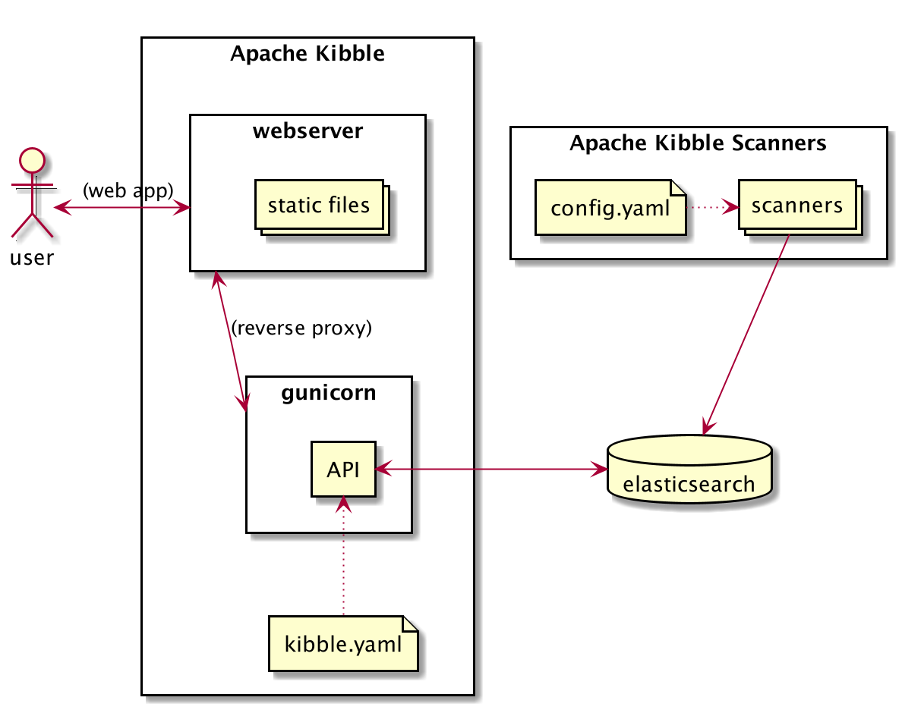

Setting up Apache Kibble
========================

.. toctree::
   :maxdepth: 2
   :caption: Contents:

****************************
Understanding the Components
****************************

Kibble consists of two major components:

The Kibble Server (kibble)
   This is the main database and UI Server. It serves as the hub for the
   scanners to connect to, and provides the overall management of
   sources as well as the visualizations and API end points.

The Kibble Scanner Applications (kibble-scanners)
   This is a collection of scanning applications each designed to work
   with a specific type of resource (a git repo, a mailing list, a JIRA
   instance etc) and push copmpiled data objects to the Kibble Server.
   Some resources only have one scanner plugin, while others may have
   multiple plugins capable of dealing with specific aspects of a
   resource.

The following diagram shows Kibble architecture:

**********************
Component Requirements
**********************

################
Server Component
################

As said, the main Kibble Server is a hub for scanners, and as such, is
only ever needed on one machine. It is recommended that, for large
instances of kibble, you place the application on a machine or VM with
sufficient resources to handle the database load and memory requirements.

As a rule of thumb, the Server does not require a lot of disk space
(enough to hold the compiled database), but it does require CPU and RAM.
The scanners require more disk space, but can operate with limited CPU
and RAM.

As an example, let us examine the Apache Kibble demo instance:

- 100 sources (git repos, mailing lists, bug trackers and so on)
- 3,5 million source objects currently (commits, emails, tickets etc)
- 10 concurrent users (actual people uing the web UI)

The recommended minimal specs for the Server component on an instance of
this size would be approximately 4-8GB RAM, 4 cores and at least 10GB
disk space. As this is a centralized component, you will want to spec
this to be able to efficiently deal with the entire database in memory
for best performance.

#################
Scanner Component
#################

The scanner components can either consist of one instance, or be spread
out in a clustered setup. Thus, the requirements can be spread out on
multiple machines or VMs. Scanners will auto-adjust the scanning speed
to match the number of CPU cores available to it; a scanner with two
cores available will run two simultaneous jobs, whereas a scanner with
eight cores will run eight simultaneous jobs to speed up processing.
A scanner will typically require somewhere between 512 and 1GB of memory,
and thus can safely run on a VM with 2GB memory (or less).

********************
Source Code Location
********************

.. This needs to change once we have released Kibble

*Apache Kibble does not currently have any releases.*
*You are however welcome to try out the development version.*

For the time being, we recommend that you use the ``master`` branch for
testing Kibble. This applies to both scanners and the server.

The Kibble Server can be found via our source repository at
https://github.com/apache/kibble

The Kibble Scanners can be found at
https://github.com/apache/kibble-scanners

*********************
Installing the Server
*********************

###############
Pre-requisites
###############

Before you install the Kibble Server, please ensure you have the
following components installed and set up:

- An ElasticSearch instance, version 6.x or newer (5.x is supported for
  existing databases, but not for new setups). Does not have to be on
  the same machine, but it may help speed up processing.
- A web server of your choice (Apache HTTP Server, NGINX, lighttp etc)
- Python 3.4 or newer with the following libraries installed:
- - elasticsearch
- - certifi
- - pyyaml
- - bcrypt
- Gunicorn for Python 3.x (often called gunicorn3) or mod_wsgi

###########################################
Configuring and Priming the Kibble Instance
###########################################
Once you have the components installed and Kibble downloaded, you will
need to prime the ElasticSearch instance and create a configuration file.

Assuming you wish to install kibble in /var/www/kibble, you would set it
up by issuing the following:

- ``git clone https://github.com/apache/kibble.git /var/www/kibble``
- ``cd /var/www/kibble/setup``
- ``pip3 install -r requirements.txt``
- ``python3 setup.py``
- Enter the configuration parameters the setup process asks for

This will set up the database, the configuration file, and create your
initial administrator account for the UI. You can later on do additional
configuration of the data server by editing the ``api/yaml/kibble.yaml``
file.

#####################
Setting up the Web UI
#####################

Once you have finished the initial setup, you will need to enable the
web UI. Kibble is built as a WSGI application, and as such you can
use mod_wsgi for apache, or proxy to Gunicorn. In this example, we will
be using the Apache HTTP Server and proxy to Gunicorn:

- Make sure you have mod_proxy and mod_proxy_http loaded (on
  debian/ubuntu, you would run: `a2enmod proxy_http`)
- Set up a virtual host in Apache:

::

   <VirtualHost *:80>
      # Set this to your domain, or add kibble.localhost to /etc/hosts
      ServerName kibble.localhost
      DocumentRoot /var/www/kibble/ui/
      # Proxy to gunicorn for /api/ below:
      ProxyPass /api/ http://localhost:8000/api/
   </VirtualHost>

- Launch gunicorn as a daemon on port 8000 (if your distro calls
  gunicorn for Python3 `gunicorn3`, make sure you use that instead):

::

   cd /var/www/kibble/api/
   gunicorn -w 10 -b 127.0.0.1:8000 handler:application -t 120 -D

Once httpd is (re)started, you should be able to browse to your new
Kibble instance.

*******************
Installing Scanners
*******************

##############
Pre-requisites
##############

.. _cloc: https://github.com/AlDanial/cloc

The Kibble Scanners rely on the following packages:

- Python >= 3.4 with the following packages:
- - python3-yaml
- - python3-elasticsearch
- - python3-certifi

The scanners require the following optional components if you wish to enable
git repository analysis:

- git binaries (GPL License)
- cloc_ version 1.76 or later (GPL License)

###########################
Configuring a Scanner Node
###########################

First, check out the scanner source in a file path of your choosing:

``git clone https://github.com/apache/kibble-scanners.git``

Then edit the ``conf/config.yaml`` file to match both the ElasticSearch
database used by the Kibble UI, as well as whatever file layout (data
and scratch dir) you wish to use on the scanner machine.
Remember that the scanner must have enough disk space to fully store
any resources you may be scanning. If you are scanning a large git repository,
the scanner should have sufficient disk space to store it locally.

If you plan to make use of the optional text analysis features of
Kibble, you should also configure the API service you will be using
(Watson/Azure/picoAPI etc).

##############################
Balancing Load Across Machines
##############################

If you wish to spread out the analysis load over several machines/VMs,
you can do so by specifying a ``scanner.balance`` on each node. The balance
directive uses the syntax X/Y, where Y is the total number of nodes in
your scanner cluster, and X is the ID of the current scanner. Thus, if
you have decided to use four machines for scanning, the first would have
a balance of 1/4, the next would be 2/4, then 3/4 and finally 4/4 on the
last machine. This will balance the load and storage requirements evenly
across all machines.

.. _runscan:

**************
Running a Scan
**************

Once you have both scanners and the data server set up, you can begin
scanning resources for data. Please refer to :ref:`configdatasources`
for how to set up various resources for scanning via the Web UI.

Scans can be initiated manually, but you may want to set up a cron job to
handle daily scans of resources. To start a scan on a scanner machine,
run the following: ``python3 src/kibble-scanner.py``

This will load all plugins and use them in a sensible order on each
resource that matches the appropriate type. The collected data will be
pushed to the main data server and be available for visualizations
instantly.

It may be worth your while to run the scanner inside a timer wrapper,
as such: ``time python3 src/kibble-scanner.py`` in order to gauge the
amount of time a scan will take, and adjusting your cron jobs to match
this.
